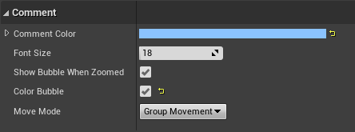

[Home](../README.md) / Blueprint 

# Blueprint Conventions

_All Blueprint screenshots on this page were based on the official "First Person" sample content pack by Epic Games. Many of their sample Blueprints do not meet the standards for this Blueprint convention._

## Naming

Naming of everything inside Blueprints (properties, functions, events) should follow the [C++ naming conventions](../C++/Naming.md).

## Properties and Functions

### Variable Settings

Make conscious decisions about the access level of your Blueprint variables and add value ranges and tooltips for exposed balancing variables to aid content creators working with your Blueprints.

### Use Property and Function Categories

Group properties into categories. It makes sense to keep all the blueprint created components in the default Components group or creating sub-groups for them.
Other than that you should consider grouping exposed balance-able properties together to separate them from internal cached state.

The same goes for functions:

## Blueprint Graph Organization

### Tight Straight Nodes
Execution pin connections should be as straight as possible. Nodes should be placed tightly without big surrounding space to make code compact without nodes overlapping to keep it readable.

Before:

After:

### Collapse Big Events
Big event chains should be collapsed to functions. This is especially true for the event graph that should just contain some "entry" events that start an execution chain (e.g. a player input) and pass everything else to functions, etc.

Before:

After:

Thre are three methods to collapse graphs all of which have advantages and disadvantages:

| Collapse Method          | Pros | Cons | Good Use Case |
|--------------------------|------|------|---------------|
| Collapse Nodes           | Mulitple execution pins possible | Not easy to find & navigate. Cannot use local variables.   | one-off functionality. whenever you need events, delays, etc |
| Collapse to **Function** | Own graph, local variables       | Too many functions can become messy. Cannot use events, delays, etc. | Reusable functionality. Whenever you need to store intermediate results. |
| Collapse to **Macro**    | Use with different variable references. Multiple execution pins. Reusable. | No compilation/errors of macro itself. Only when used. Harder to debug. No local variables. | Reusable flow control with multiple execution pins. |

### Avoid Overlaps
This is especially crucial for nodes and execution paths.

Before:

After:

### Use Reroute Nodes

Try to have as few parallel/overlapping connections. Branch at the latest possible point. Use reroute nodes to keep the connections clean and clear.

Before:

After:

### Align Nodes

Aligning multiple nodes is easily possible by selecting them and using the shift + [W/A/S/D] shortcuts.

Before:

After:

For a matter of consistency, variable nodes connected to function inputs should be placed left of the target node:

Alternatively you can place the inputs above and below. In this style the input to **Target input** should be placed **above** the node with nodes for **any other parameters** placed **below** the target node.

Please note that any nodes placed in this way must be sorted in the same way as the function inputs so they can be easily associated without having to follow the node connections.

This use-case in an exception to the "connections must not intersect" rule from above.

### Use Sequence Nodes

Sequence nodes can help reducing the horizontal space a function requires and making it more compact. A good starting point is using sequence nodes whenever you don't need data from one execution to the next, just the right sequential order.

Before:

After:

### Use Comment Boxes

Using comment boxes in additon to this can help distinguishing the individual steps of an operation without requiring collapsing them to a function. This can be a better option when you only need the operations inside this specific context.

Coloring the comment (with subdued colors) based on context can also help making certain sections more recognizable. You should be consistent with the colors inside a single blueprint, but there is no good color scheme that fits for all projects.

When coloring the comment boxes it is reccommended to turn on the color bubble checkbox, so the zoomed out bubbles get the same color as the comment box itself:

However you should only use subdued colors for regular comment boxes, so you can reserve high contrast colors for comment boxes that really need to catch the eye, e.g. bugfix TODOs:

### Create Additional Event Graphs

For self contained event graphs (e.g. a sub-simulation) or events that may be logically grouped together it can be worthwhile to add separate event graphs. Common contexts for this are
- Input event graphs
- Sound event graphs
- VFX event grpahs

